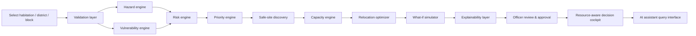

# GARUDA Architecture Overview

## Prototype notes

- The MVP uses synthetic, demonstration-grade geospatial data to represent Uttarakhand pilot conditions.
- The calculation pipeline remains deterministic and explainable; no numerical decisions are delegated to an LLM.
- Resource checks are integrated into the same decision flow so that relocation feasibility depends on both safety and availability.
